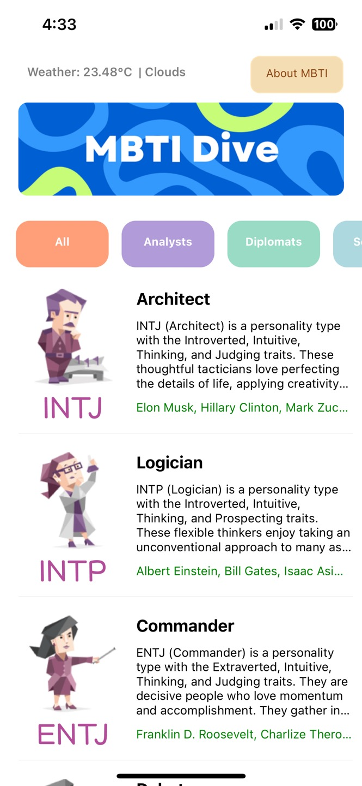
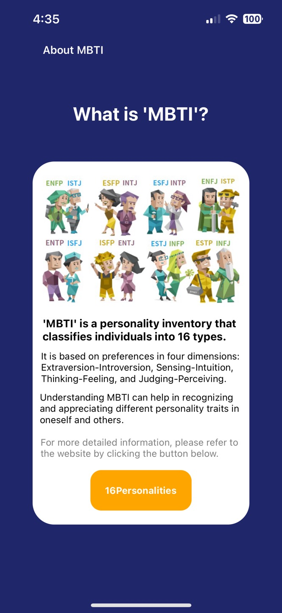

# MBTI-Dive
Dive into personality with MBTI Dive! Explore types, save favorites, and find your true self with linked MBTI tests.

https://github.com/user-attachments/assets/20f71a47-acf6-4b7a-a752-0d7f7f828ae5

## Overview
This app allows users to explore the Myers-Briggs Type Indicator (MBTI) personality types. Users can view detailed information about each MBTI type, see famous individuals with each type, and add their favorite types to a favorites list. The app also provides weather information based on the user's current location to enhance the user experience.

## Key Features
### 1. Main Page

- Fetch MBTI data from Firebase
- Provide location-based weather information
- Filter MBTI types by category
- Navigate to the "About MBTI" page
- Navigate to the Favorites page

### 2. Detail Page

    
    
  

- Display detailed information about the selected MBTI type
- Show description and famous individuals associated with the type
- Add type to favorites
- Share feature
- Link to additional information website

### 3. Favorites Page

    
    

- Manage favorites using the unique device ID
- Fetch and display favorite MBTI types from Firebase

### 4. About Page

- Provide an introduction and explanation of MBTI
- Link to a website with more detailed information

## Tech Stack
- **React Native**: For building the mobile application.
- **Expo**: For a streamlined development workflow.
- **Firebase**: For backend services, including real-time database.
- **OpenWeatherMap API**: For fetching weather information based on user location.
- **Axios**: For making API requests.
- **Expo Location**: For accessing the device's location services.
